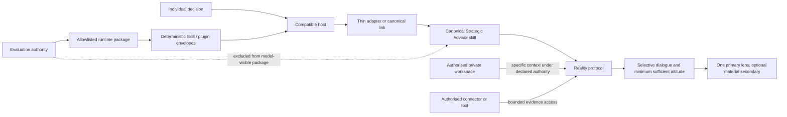

# Architecture

Strategic Advisor is one canonical Agent Skill with a small core, an owner-controlled personal-context layer, and selectively loaded decision lenses. It is not a custom multi-agent framework, a central memory service, or a set of copied vendor prompts.

## Why this shape

The reality protocol is domain-independent: claim provenance, contradiction handling, readiness, competing explanations, action calibration, and falsifiable controls should not change because a question concerns a product rather than a career. The domain lenses are materially different where evidence, causal mechanisms, decision rights, power, stakeholder agency, and characteristic failure modes differ. This avoids both false separation and a single generic prompt that treats every decision as the same problem.

The current six lenses are project/product, career, organisational influence, people leadership, business/venture, and marketing/growth. They reuse the core rather than redefining it. The conversational contract activates that core only for a material decision, climbs from tactic to outcome, portfolio, or whole-person context only when the higher level could change the answer, then returns to a bounded move.

Exact age, relationships, household circumstances, health constraints, finances, location, commitments, and other personal facts may be necessary strategic inputs. They are not anonymised merely because they are personal. This does not turn the product into a qualified legal, medical, clinical, or financial professional: it may reason about how those facts constrain or change strategy while naming where specialist evidence or judgment is required.

Durable context belongs in a user-controlled Strategy Workspace, never in the generic product package. Retention mode controls persistence, while separate authorities control reading, durable writing, external action, disclosure, and cross-workspace access. A work or shared account can therefore use session-only or bounded retention without forcing personal users to sterilise their analysis.

Professional influence is treated as real strategy. Truthful framing, private preparation, sequencing, negotiation, coalition building, incentive alignment, accountability, credible alternatives, and proportionate consequences are legitimate subjects. Stakeholders remain autonomous and adaptive; the system does not make plans depend silently on obedience, inferred motives, material deception, coercion, exploitation, or hidden monitoring.

## Host boundary

Host integrations point to or package the canonical allowlisted runtime. The repo-local Codex adapter is a relative symlink for authoring; end-user artifacts are generated as a standalone Agent Skills archive, a skill-only OpenAI local plugin/marketplace archive, and a paid-personal ChatGPT Custom GPT kit. Skill-capable hosts receive unchanged runtime bytes. Because personal ChatGPT Custom GPTs use Instructions plus Knowledge rather than Personal Skills, that adapter is generated deterministically: canonical `SKILL.md` becomes the strategic Instructions body and the remaining declared runtime resources become exact Knowledge files. No host prompt is maintained independently. Codex, Claude Code, Claude.ai, ChatGPT, and any future host must each prove discovery, activation, and source identity before being called supported. Connectors are evidence access only: access does not establish accuracy, completeness, permission to disclose, or authority to act.

## Evaluation boundary

Evaluation definitions live beside the source for review, but a content-addressed allowlist builds the model-visible treatment package. Case prompts, expected properties, rubrics, scoring contracts, and prior outputs are excluded by path, filename, content fingerprints, and human byte review before a frozen run. Personal-context evaluations use synthetic but exact facts so specificity, retention modes, correction, deletion, isolation, disclosure, staleness, and specialist boundaries can be tested without publishing a real user's private workspace. Structural checks establish repository invariants; only a preregistered behavioural comparison and consented pilots can establish observed usefulness under their recorded conditions.

See [PRODUCT-CONTRACT.md](PRODUCT-CONTRACT.md) for current claims and [`skills/strategic-advisor/SKILL.md`](skills/strategic-advisor/SKILL.md) for the canonical product.
